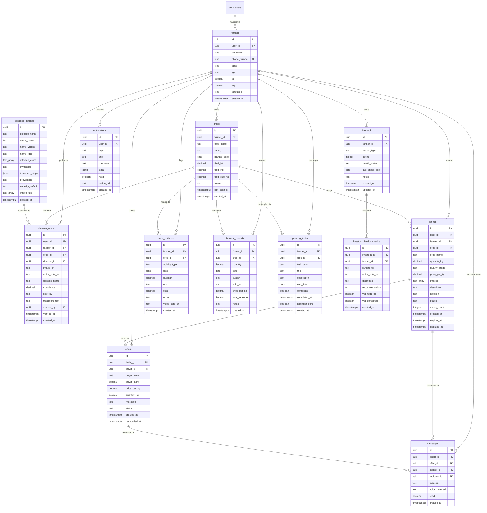
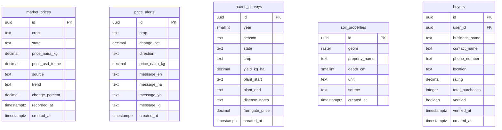

# FarmFlow Database Entity Relationship Diagram

## Overview

This document provides a visual representation of the FarmFlow database schema, showing table relationships and key constraints.

---

## Core Schema Diagram



---

## Market & Reference Data Tables



---

## Table Relationships Summary

### Primary Relationships

| Parent Table | Child Table | Relationship Type | Description |
|--------------|-------------|-------------------|-------------|
| auth.users | farmers | 1:1 | Each auth user has one farmer profile |
| farmers | crops | 1:N | Farmer can have multiple crops |
| farmers | disease_scans | 1:N | Farmer can perform multiple scans |
| farmers | listings | 1:N | Farmer can create multiple listings |
| farmers | farm_activities | 1:N | Farmer logs multiple activities |
| crops | disease_scans | 1:N | Crop can be scanned multiple times |
| crops | harvest_records | 1:N | Crop can be harvested multiple times |
| diseases_catalog | disease_scans | 1:N | Disease can be identified in multiple scans |
| listings | offers | 1:N | Listing can receive multiple offers |
| farmers | livestock | 1:N | Farmer can own multiple livestock groups |
| livestock | livestock_health_checks | 1:N | Livestock can have multiple health checks |

### Cross-Reference Relationships

| Table 1 | Table 2 | Via | Description |
|---------|---------|-----|-------------|
| farmers | farmers | offers | Farmers can be buyers making offers |
| listings | messages | listing_id | Messages can reference listings |
| offers | messages | offer_id | Messages can reference offers |
| farmers | farmers | messages | Farmers message each other |

---

## Key Constraints

### Unique Constraints

```sql
-- Farmers
UNIQUE (phone_number)

-- Market Prices
UNIQUE (crop, state, source, recorded_at::DATE)

-- NAERLS Surveys
UNIQUE (year, season, state, crop)
```

### Check Constraints

```sql
-- Farmers
CHECK (language IN ('hausa','yoruba','igbo','english'))

-- Crops
CHECK (status IN ('active','harvested','failed'))

-- Disease Scans
CHECK (severity IN ('low','medium','high'))
CHECK (confidence >= 0 AND confidence <= 1)

-- Listings
CHECK (quality_grade IN ('A','B','C'))
CHECK (status IN ('active','sold','expired','cancelled'))

-- Offers
CHECK (status IN ('pending','accepted','rejected','completed','cancelled'))

-- Price Alerts
CHECK (direction IN ('up','down'))

-- NAERLS Surveys
CHECK (season IN ('wet','dry'))

-- Livestock
CHECK (animal_type IN ('goat','chicken','cow','sheep','pig'))
CHECK (health_status IN ('healthy','sick','critical'))
```

### Foreign Key Constraints

All foreign keys use `ON DELETE CASCADE` or `ON DELETE SET NULL` depending on business logic:

- **CASCADE**: When parent is deleted, child records are also deleted
  - farmers → crops, disease_scans, listings, etc.
  - crops → disease_scans, harvest_records
  - listings → offers
  
- **SET NULL**: When parent is deleted, foreign key is set to NULL
  - disease_scans.verified_by (extension officer)
  - offers.buyer_id (if buyer account deleted)

---

## Indexes Strategy

### Primary Indexes (Automatic)

All tables have primary key indexes on `id` column.

### Foreign Key Indexes

```sql
-- Automatically created for all FK columns
CREATE INDEX idx_crops_farmer_id ON crops(farmer_id);
CREATE INDEX idx_disease_scans_farmer_id ON disease_scans(farmer_id);
CREATE INDEX idx_listings_farmer_id ON listings(farmer_id);
-- ... etc for all FK columns
```

### Performance Indexes

```sql
-- Frequently queried columns
CREATE INDEX idx_farmers_phone ON farmers(phone_number);
CREATE INDEX idx_farmers_state ON farmers(state);
CREATE INDEX idx_crops_status ON crops(status) WHERE status = 'active';
CREATE INDEX idx_listings_status ON listings(status) WHERE status = 'active';

-- Time-based queries
CREATE INDEX idx_disease_scans_created ON disease_scans(created_at DESC);
CREATE INDEX idx_farm_activities_date ON farm_activities(date DESC);
CREATE INDEX idx_market_prices_recorded ON market_prices(recorded_at DESC);

-- Composite indexes for common queries
CREATE INDEX idx_market_prices_crop_state ON market_prices(crop, state, recorded_at DESC);
CREATE INDEX idx_notifications_user_unread ON notifications(user_id, read) WHERE read = false;
```

### Spatial Indexes (PostGIS)

```sql
-- Location-based queries
CREATE INDEX idx_farmers_location ON farmers USING GIST(ST_MakePoint(lng, lat));
CREATE INDEX idx_soil_properties_geom ON soil_properties USING GIST(ST_ConvexHull(geom));
```

### Full-Text Search Indexes

```sql
-- Text search on disease names
CREATE INDEX idx_diseases_name_trgm ON diseases_catalog USING GIN(disease_name gin_trgm_ops);

-- Text search on crop names
CREATE INDEX idx_crops_name_trgm ON crops USING GIN(crop_name gin_trgm_ops);
```

---

## Row Level Security (RLS) Policies

### Policy Summary

| Table | Policy Name | Operation | Rule |
|-------|-------------|-----------|------|
| farmers | Farmers access own profile | ALL | auth.uid() = user_id |
| crops | Farmers access own crops | ALL | farmer_id IN (SELECT id FROM farmers WHERE user_id = auth.uid()) |
| disease_scans | Users access own scans | ALL | user_id = auth.uid() |
| listings | Public read active listings | SELECT | status = 'active' |
| listings | Farmers edit own listings | UPDATE/DELETE | farmer_id IN (SELECT id FROM farmers WHERE user_id = auth.uid()) |
| offers | Listing owner views offers | SELECT | listing_id IN (SELECT id FROM listings WHERE farmer_id IN (SELECT id FROM farmers WHERE user_id = auth.uid())) |
| offers | Buyers view own offers | SELECT | buyer_id IN (SELECT id FROM farmers WHERE user_id = auth.uid()) |
| farm_activities | Farmers access own activities | ALL | farmer_id IN (SELECT id FROM farmers WHERE user_id = auth.uid()) |
| notifications | Users access own notifications | ALL | user_id = auth.uid() |
| messages | Users access own messages | ALL | sender_id = auth.uid() OR recipient_id = auth.uid() |
| market_prices | Public read | SELECT | true |
| price_alerts | Public read | SELECT | true |
| diseases_catalog | Public read | SELECT | true |
| naerls_surveys | Public read | SELECT | true |
| buyers | Public read verified | SELECT | verified = true |

---

## Storage Buckets Structure

### Bucket: crop-photos

```
crop-photos/
├── {user_id}/
│   ├── {timestamp}_1.jpg
│   ├── {timestamp}_2.jpg
│   └── ...
```

**RLS**: Users can only upload/read from their own folder

### Bucket: voice-notes

```
voice-notes/
├── {user_id}/
│   ├── {timestamp}_disease.webm
│   ├── {timestamp}_activity.webm
│   └── ...
```

**RLS**: Users can only upload/read from their own folder

### Bucket: listing-photos

```
listing-photos/
├── {user_id}/
│   ├── {listing_id}_1.jpg
│   ├── {listing_id}_2.jpg
│   └── ...
```

**RLS**: Public read, authenticated write to own folder

### Bucket: ndvi-maps

```
ndvi-maps/
├── {farm_id}/
│   ├── {date}_ndvi.png
│   └── ...
```

**RLS**: Farmers can only read their own farm's maps

---

## Database Functions

### Utility Functions

```sql
-- Get soil properties at GPS coordinates
get_soil_at_point(lat FLOAT, lng FLOAT)
  RETURNS TABLE (property_name TEXT, value FLOAT, unit TEXT, depth_cm SMALLINT)

-- Update listing view count
increment_listing_views(listing_uuid UUID)
  RETURNS void

-- Calculate buyer rating
update_buyer_rating(buyer_uuid UUID)
  RETURNS void

-- Expire old listings
expire_old_listings()
  RETURNS void

-- Update timestamp trigger
update_updated_at_column()
  RETURNS TRIGGER
```

---

## Data Flow Examples

### Example 1: Disease Scan Flow

```
1. Farmer uploads photo → crop-photos bucket
2. Frontend calls disease detection API
3. API returns disease_id and confidence
4. Insert into disease_scans table
5. Trigger notification to farmer
6. Extension officer can verify scan
```

### Example 2: Market Listing Flow

```
1. Farmer creates listing → listings table
2. Upload photos → listing-photos bucket
3. System matches with buyers
4. Buyers make offers → offers table
5. Farmer receives notification
6. Messages exchanged → messages table
7. Offer accepted → update listing status
```

### Example 3: Farm Activity Logging

```
1. Farmer logs activity (voice or text)
2. Voice note uploaded → voice-notes bucket
3. Insert into farm_activities table
4. Link to crop_id if applicable
5. Update crop.last_scan_at if relevant
6. Generate planting_task if needed
```

---

## Migration Order

### Phase 1: Foundation
1. Enable extensions (postgis, pgcrypto, pg_trgm)
2. Create farmers table
3. Create crops table
4. Set up RLS policies

### Phase 2: Core Features
1. Create disease_scans, diseases_catalog
2. Create market_prices, price_alerts
3. Create listings, offers, buyers
4. Set up storage buckets

### Phase 3: Farm Management
1. Create farm_activities
2. Create harvest_records
3. Create planting_tasks
4. Create livestock tables

### Phase 4: Communication
1. Create notifications
2. Create messages
3. Set up realtime subscriptions

### Phase 5: Reference Data
1. Create naerls_surveys
2. Create soil_properties
3. Load seed data

### Phase 6: Optimization
1. Create all indexes
2. Create functions and triggers
3. Performance testing
4. Query optimization

---

## Monitoring Queries

### Check Table Sizes

```sql
SELECT
  schemaname,
  tablename,
  pg_size_pretty(pg_total_relation_size(schemaname||'.'||tablename)) AS size
FROM pg_tables
WHERE schemaname = 'public'
ORDER BY pg_total_relation_size(schemaname||'.'||tablename) DESC;
```

### Check Index Usage

```sql
SELECT
  schemaname,
  tablename,
  indexname,
  idx_scan,
  idx_tup_read,
  idx_tup_fetch
FROM pg_stat_user_indexes
ORDER BY idx_scan DESC;
```

### Check Slow Queries

```sql
SELECT
  query,
  calls,
  total_time,
  mean_time,
  max_time
FROM pg_stat_statements
ORDER BY mean_time DESC
LIMIT 20;
```

---

**Document Version**: 1.0
**Last Updated**: 2026-05-16
**Status**: Ready for Implementation